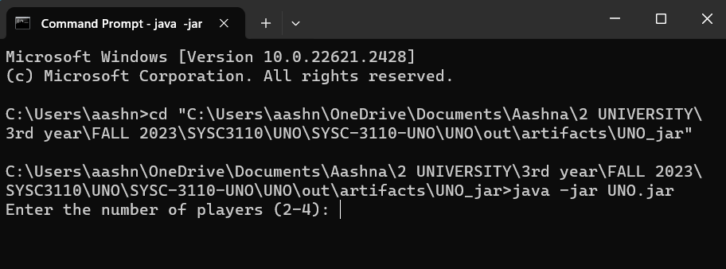

# SYSC-3110-UNO
_Final group project for SYSC 3110_  
__Current Status: Milestone 2__

## Table of content
* [Project Description](#project-description)  
* [System requirements](#system-requirements)  
* [Installation](#installation)   
* [User Manual](#user-manual) 
* [Copyright](#copyright) 
* [Contributors](#contributors)

## Project Description

A playable version of the Uno card game, allowing players to engage through the console using buttons on the Java GUI. Within this version, players will have the capability to:

1. View their drawn cards.
2. Place cards.
3. Draw one card.
4. Execute actions associated with special cards, including Reverse, Skip, Wild, and Wild Draw Two cards.
5. Observe the resultant state of the cards, presented in text format.

## System requirements

* Java Runtime Environment (JRE 8 or later)
    * Download: https://www.oracle.com/ca-en/java/technologies/downloads/#java21

## User Manual
1. Using the cmd, navigate to UNO.jar using `cd <filepath>`
2. Run the jar using `java -jar UNO.jar`
3. Follow the instructions on the terminal and enjoy!!

## Copyright
Uno® is a registered trademark of Mattel, Inc. This software is an unofficial implementation of the Uno card game and is not affiliated with or endorsed by Mattel, Inc. All rights to the original Uno card game and its trademarks are owned by Mattel, Inc.

For more information on Uno, including: rules, history, etc, visit: https://en.wikipedia.org/wiki/Uno_(card_game)

## Contributors
Aashna Verma 101225434  
Brian Tran 101231003  
Darren Wallace 101233334  
Angus Jull 101224748
