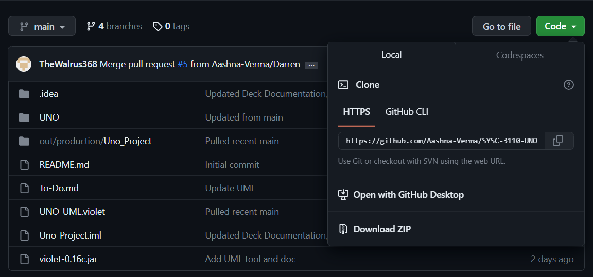

# SYSC-3110-UNO
_Final group project for SYSC 3110_

## Table of content
* [Project Description](#project-description)  
* [System requirements](#system-requirements)  
* [Installation](#installation)  
* [Milestone 1](#milestone-1)  
* [Milestone 2](#milestone-2)    
* [Milestone 3](#milestone-3)  
* [Milestone 4](#milestone-4)   
* [Contributors](#contributors)

## Project Description

A text-based, playable version of the Uno card game, allowing players to engage through the console using keyboard input. Within this version, players will have the capability to:

1. View their drawn cards.
2. Place cards using the official notation as detailed in the Wikipedia link.
3. Draw one card.
4. Execute actions associated with special cards, including Reverse, Skip, Wild, and Wild Draw Two cards.
5. Observe the resultant state of the cards, presented in text format.

## System requirements

* Java Runtime Environment (JRE 8 or later)
    * Download: https://www.oracle.com/ca-en/java/technologies/downloads/

* Access to Github
    * Login or create a Github account: https://github.com/
    * Access the repository: https://github.com/Aashna-Verma/SYSC-3110-UNO

## Installation
1. Download SYSC3110_UNO project 

  As a zip or in terminal use `git clone <HTTPS url>`
2. Navigate to jar using `cd ~\UNO\out\artifacts\UNO_jar\UNO.jar`
3. Run the jar using `java -jar UNO.jar`

## Milestone 1
## Milestone 2
## Milestone 3
## Milestone 4

## Contributors
Aashna Verma 101225434  
Brian Tran 101231003  
Darren Wallace  
Angus Jull